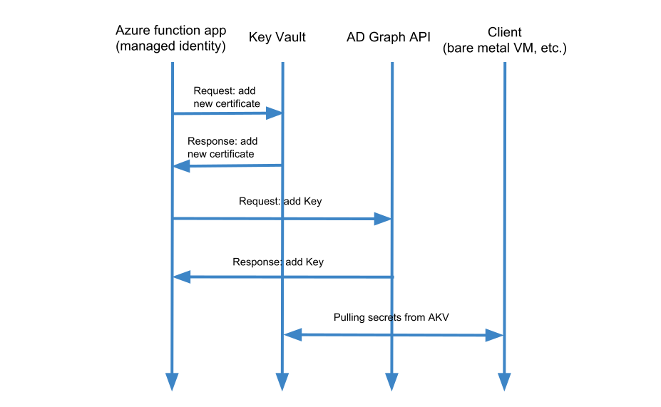
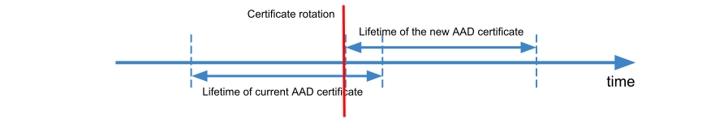
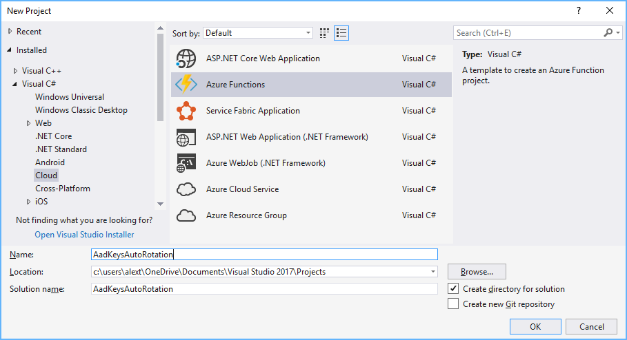
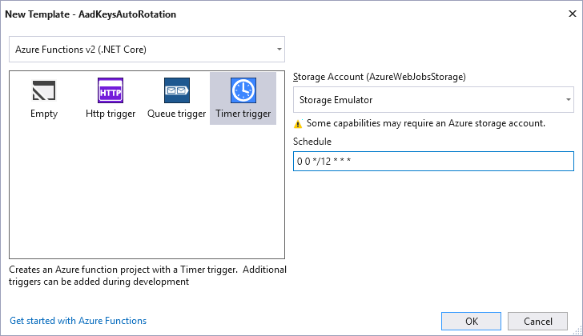
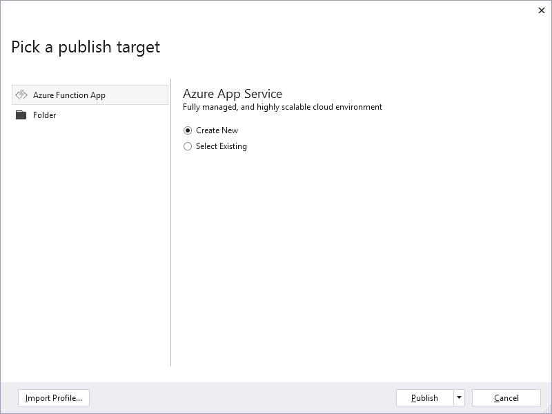
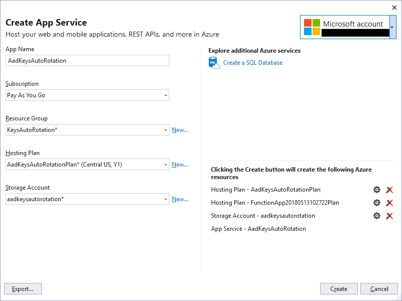
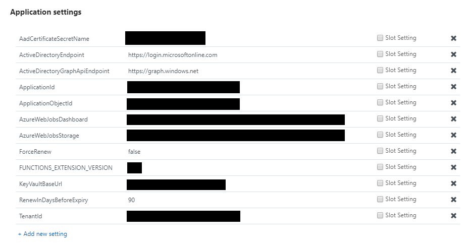
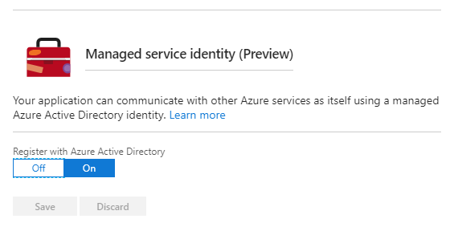
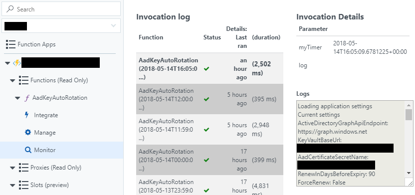

In the [first post](/blog/archive/2018/4/secrets-auto-rotation-iis-ssl-certs) of the series regarding [secrets auto-rotation](/blog/tag/secrets-autorotation), I mentioned AAD certificate as part of a communication process between a client and Key Vault. Now it's time to touch this topic in more details.

You may need AAD application for different reasons, and Key Vault access is one of them (how it was in the case of the first post).

> **NOTE:** If you have Azure connected VM you can reach Key Vault using [MSI (managed service identity)](https://docs.microsoft.com/en-us/azure/active-directory/managed-service-identity/overview). There are many other use cases where you may need AAD application, and you can't leverage the power of MSI so this post will be useful anyway.

Certificate-based authentication with AAD application is not the only one option (you can use keys or user credentials), but this method indeed the most practical from my experience.

Summarizing above, the algorithm of ADD certificate auto-rotation is on the way!

<!--more-->

# Server side
The whole magic for certificate auto-rotation will happen in this step using  [Azure Functions](https://azure.microsoft.com/en-us/services/functions) application.

Why functions?
* _Serverless_ - we are not required to pay for dedicated and expensive servers, we can use consumption plan and only pay when we use it. Since we will trigger auto-rotation not so often, we can save a lot of money.
* _Scheduled trigger_ - since we need to rotate keys periodically, it's perfect that we have this feature out of the box.
* _MSI_ - we will use this feature to communicate with Key Vault, mainly we can grand access to Key Vault for our function application without configuring additional credentials.

All of those reasons make a function application a perfect tool to accomplish our goal.

First of all, I would like to share with you the overall picture what are we going to implement:



1. Using managed Identity, Azure Functions application talks to Key Vault to request new AAD self-signed certificate. 
2. Azure Functions application generates [AD Access Token](https://docs.microsoft.com/en-us/dotnet/api/microsoft.identitymodel.clients.activedirectory.authenticationcontext.acquiretokenasync?view=azure-dotnet) using last working certificate from Key Vault. 
3. Azure Functions application generates [Proof Token](https://msdn.microsoft.com/en-us/library/azure/ad/graph/api/functions-and-actions#request-body-10) for possession of owning the current certificate. 
4. Using access and proof tokens Azure Functions application requests AD graph API to [add new Key (certificate)](https://msdn.microsoft.com/en-us/library/azure/ad/graph/api/functions-and-actions#AddKey) to AAD application.  
5. Client periodically pulls all secrets (including new certificate) from Key Vault.

> **NOTE:** Because we are using the current, non-expired AAD certificate to create and register the new one, we have to do it in advance, before the expiration of the current certificate. The second reason, we need to give some time for the client to pull new certificate from Key Vault to provide seamless, non-destructive process. 



## Creating project

To begin with let's open Visual Studio and create Azure Functions project:



Then we should choose **Timer trigger** (schedule expression is specified in [cron](https://en.wikipedia.org/wiki/Cron) format):


Once the empty project is created, we can start writing code. Let's add the following NuGet packages to the project:
* Microsoft.Azure.KeyVault
* Microsoft.Azure.Services.AppAuthentication
* System.IdentityModel.Tokens.Jwt

## Implementation
### Entry point

Now we are ready to write the main logic for our function application. I tried to write self-descriptive code and left some comments as well.

**Function.cs**
```csharp
namespace AadKeyAutoRotation
{
    using System;
    using System.Linq;
    using System.Threading.Tasks;
    using AadKeyAutoRotation.Extensions;
    using AadKeyAutoRotation.GraphApi;
    using AadKeyAutoRotation.Helpers;
    using Microsoft.Azure.KeyVault;
    using Microsoft.Azure.Services.AppAuthentication;
    using Microsoft.Azure.WebJobs;
    using Microsoft.Azure.WebJobs.Host;

    public static class Function
    {
        [FunctionName("AadKeyAutoRotation")]
        public static async Task Run([TimerTrigger("0 0 */12 * * *", RunOnStartup = true)]TimerInfo myTimer, TraceWriter log)
        {
            // Load application settings
            log.Info($"Loading application settings");
            var environmentVariables = Environment.GetEnvironmentVariables(EnvironmentVariableTarget.Process);
            var appSettings = ConfigurationHelper.ReadSettings<AppSettings>(environmentVariables);
            var aadAppContext = ConfigurationHelper.ReadSettings<AadAppContext>(environmentVariables);
            log.Info($"Current settings");
            ObjectHelper.Print(appSettings, log);
            ObjectHelper.Print(aadAppContext, log);
            log.Info(string.Empty);

            var aadGraphApiClient = new AadGraphApiClient(appSettings.ActiveDirectoryGraphApiEndpoint, log);
            var azureServiceTokenProvider = new AzureServiceTokenProvider();
            var kv = new KeyVaultClient(new KeyVaultClient.AuthenticationCallback(azureServiceTokenProvider.KeyVaultTokenCallback));

            // Get current AAD certificate
            log.Info("Getting current AAD certificate");
            var aadAuthCertSecret = await kv.GetSecretAsync(appSettings.KeyVaultBaseUrl, appSettings.AadCertificateSecretName);
            var aadAuthCert = CertificateHelper.Base64StringToCertificate(aadAuthCertSecret.Value);
            var currentCertificateExpiresIn = aadAuthCert.NotAfter - DateTime.Now;
            log.Info($"Current certificate properties:");
            log.Info($"Thumbprint: {aadAuthCert.Thumbprint}");
            log.Info($"Expires on: {aadAuthCert.NotAfter}");
            log.Info($"Expires in: {currentCertificateExpiresIn.Days} days");
            log.Info(string.Empty);

            log.Info("Getting certificate policy");
            var certificatePolicy = await kv.GetCertificatePolicyAsync(appSettings.KeyVaultBaseUrl, appSettings.AadCertificateSecretName);
            var certificateLifetimeActionTrigger = certificatePolicy.LifetimeActions.FirstOrDefault()?.Trigger;
            var renewInDays = (certificateLifetimeActionTrigger.DaysBeforeExpiry ?? appSettings.RenewInDaysBeforeExpiry) + 1;
            log.Info($"Renew in {renewInDays} days before expiry");
            log.Info(string.Empty);

            // Clear already expired keys from AAD application
            log.Info("Checking if there are already expired keys for the application");
            await aadGraphApiClient.CleanExpiredKeysAsync(aadAppContext, aadAuthCert);
            log.Info(string.Empty);

            if (appSettings.ForceRenew)
            {
                log.Info($"{nameof(AppSettings.ForceRenew)} is set to TRUE, forcing renewal of certificate");
            }

            if (!appSettings.ForceRenew && currentCertificateExpiresIn.Days >= renewInDays)
            {
                log.Info("Based on current policy certificate will not be renewed");
                return;
            }

            // Create new AAD certificate
            log.Info("Requesting new certificate");
            await kv.CreateCertificateAsync(appSettings.KeyVaultBaseUrl, appSettings.AadCertificateSecretName);

            log.Info("Waiting for certificate creation");
            await kv.WaitForCertificateCreationAsync(appSettings.KeyVaultBaseUrl, appSettings.AadCertificateSecretName);

            var newAadCertificateSecret = await kv.GetSecretAsync(appSettings.KeyVaultBaseUrl, appSettings.AadCertificateSecretName);
            var newAadCertificate = CertificateHelper.Base64StringToCertificate(newAadCertificateSecret.Value);
            log.Info($"The new certificate thumbprint: {newAadCertificate.Thumbprint}");

            // Register new AAD certificate with AAD application
            await aadGraphApiClient.AddKeyAsync(aadAppContext, aadAuthCert, newAadCertificate);
        }
    }
}
```

As you may notice, the provided code has some user-defined types, so let's fulfill the gaps.

### Extensions: Key Vault Client

Here we are going to define the method which will wait for certificate creation.

**KeyVaultClientExtensions.cs**
```csharp
namespace AadKeyAutoRotation.Extensions
{
    using System;
    using System.Diagnostics;
    using System.Threading.Tasks;
    using Microsoft.Azure.KeyVault;
    using Microsoft.Azure.KeyVault.Models;

    public static class KeyVaultClientExtensions
    {
        public static TimeSpan DefaultTimeout = TimeSpan.FromMinutes(5);
        public static TimeSpan DefaultPingInterval = TimeSpan.FromSeconds(2);
        private static readonly string CompletedOperationStatus = "completed";

        public static async Task WaitForCertificateCreationAsync(this IKeyVaultClient kv, string vaultBaseUrl, string certificateName, TimeSpan? timeout = null)
        {
            CertificateOperation status = null;
            var operationTimeout = timeout ?? DefaultTimeout;
            var stopwatch = Stopwatch.StartNew();

            do
            {
                if (stopwatch.Elapsed >= operationTimeout)
                {
                    throw new TimeoutException($"{nameof(WaitForCertificateCreationAsync)} method timeouted.");
                }

                status = await kv.GetCertificateOperationAsync(vaultBaseUrl, certificateName);
                await Task.Delay(DefaultPingInterval);
            }
            while (!string.Equals(status.Status, CompletedOperationStatus, StringComparison.InvariantCultureIgnoreCase));
        }
    }
}
```

### Models: Application Settings

This class represents set of settings (properties) for our function application. Later we will use reflection to map environment variables to properties of this class.

* **ActiveDirectoryGraphApiEndpoint** - base URL for AD Graph API, you can find the value in Azure portal: _Azure Active Directory_ > _App registrations_ > _Endpoints_ > _MICROSOFT AZURE AD GRAPH API ENDPOINT_ (Note: We need only the base URL part, like https://graph.windows.net ).
* **KeyVaultBaseUrl** - base URL for Key Vault with your AAD certificate. To find out the value you should navigate in Azure portal following this path: _Key Valut_ > _Properties_ > _DSN NAME_.
* **AadCertificateSecretName** - name of the secret (AAD certificate) in Key Vault: _Key Vault_ > _Certificates_ > _Your-AAD-Certificate_.
* **RenewInDaysBeforeExpiry** - by default we are going to use issuance policy for a certificate, like E-mail all contacts at a given number of days before expiry, but if there is no such policy, we will use this value.
* **ForceRenew** - in case if you want to force certificate renewal regardless of expiration date (for instance before revocation the current one), you can use this flag but don't forget to set the value back.

**AadKeyAutoRotation.cs**

```csharp
namespace AadKeyAutoRotation
{
    public class AppSettings
    {
        public string ActiveDirectoryGraphApiEndpoint { get; set; }

        public string KeyVaultBaseUrl { get; set; }

        public string AadCertificateSecretName { get; set; }

        public int RenewInDaysBeforeExpiry { get; set; }

        public bool ForceRenew { get; set; }
    }
}
```

### Models: AAD Application Context

AAD application-related properties like application and tenant id we will keep here.

* **ActiveDirectoryEndpoint** - base URL for Active Directory. You can find the value in the portal: _Azure Active Directory_ > _App registrations_ > _Endpoints_ > _OAUTH 2.0 TOKEN ENDPOINT_ (Note: We need only the base URL part, like https://login.microsoftonline.com ).
* **TenantId** - Active Directory ID, Azure portal path:  _Azure Active Directory_ > _Properties_ > _Directory ID_.
* **ApplicationId** - ID for AAD application, Azure portal path: _Azure Active Directory_ > _App registrations_ > _Your-Application_ > _Application ID_
* **ApplicationObjectId** - object ID for AAD application, Azure portal path: _Azure Active Directory_ > _App registrations_ > _Your-Application_ > _Object ID_

**AadAppContext.cs**

```csharp
namespace AadKeyAutoRotation.GraphApi
{
    public class AadAppContext
    {
        public string ActiveDirectoryEndpoint { get; set; }

        public string TenantId { get; set; }

        public string ApplicationId { get; set; }

        public string ApplicationObjectId { get; set; }
    }
}
```

### Models: AAD Application for Graph API

We are going to use this class for deserialization of response data from AD Graph API. KeyCredentials collection will contain the information about currently registered certificates of AAD application (certificate thumbprint, expiration date, key id, etc.).

**ApplicationModel.cs**

```csharp
namespace AadKeyAutoRotation.GraphApi
{
    using System;
    using System.Collections.Generic;
    using System.Linq;
    using System.Text;

    public class ApplicationModel
    {
        public Guid AppId { get; set; }

        public Guid ObjectId { get; set; }

        public string DisplayName { get; set; }

        public List<KeyCredential> KeyCredentials { get; set; }

        public class KeyCredential
        {
            public string KeyId { get; set; }

            public string CustomKeyIdentifier { get; set; }

            public DateTime StartDate { get; set; }

            public DateTime EndDate { get; set; }

            public string Usage { get; set; }

            public string Type { get; set; }

            public string Thumbprint
            {
                get
                {
                    var certHash = Convert.FromBase64String(this.CustomKeyIdentifier);
                    var thumbprint = certHash.Aggregate(new StringBuilder(), (sb, b) => sb.Append(b.ToString("X2"))).ToString();

                    return thumbprint;
                }
            }
        }
    }
}
```

### Helpers: Certificates

This type defines one helper method for converting base 64 string to C# certificate object. Since Key Vault client does not have a built-in method to get a certificate with a private key, we need to have this code.

**CertificateHelper.cs**

```csharp
namespace AadKeyAutoRotation.Helpers
{
    using System;
    using System.Security.Cryptography.X509Certificates;

    public static class CertificateHelper
    {
        public static X509Certificate2 Base64StringToCertificate(string base64Cert)
        {
            var certBytes = Convert.FromBase64String(base64Cert);

            var cert = new X509Certificate2();
            cert.Import(certBytes, string.Empty, X509KeyStorageFlags.Exportable | X509KeyStorageFlags.MachineKeySet | X509KeyStorageFlags.PersistKeySet);

            return cert;
        }
    }
}
```

### Helpers: Configuration

Azure Functions store all settings for the application in environment variables list. This class helps to bind them to an object.

**ConfigurationHelper.cs**
```csharp
namespace AadKeyAutoRotation.Helpers
{
    using System;
    using System.Collections;
    using System.Reflection;

    public static class ConfigurationHelper
    {
        public static void ReadSettings(IDictionary environmentVariables, object obj)
        {
            var props = obj.GetType().GetProperties(BindingFlags.Public | BindingFlags.Instance | BindingFlags.SetProperty);

            foreach (var prop in props)
            {
                if (!environmentVariables.Contains(prop.Name))
                {
                    throw new ArgumentException($"'{prop.Name}' parameter is not present in settings collection.");
                }

                prop.SetValue(obj, Convert.ChangeType(environmentVariables[prop.Name], prop.PropertyType));
            }
        }

        public static TModel ReadSettings<TModel>(IDictionary environmentVariables)
            where TModel : new()
        {
            var model = new TModel();
            ReadSettings(environmentVariables, model);
            return model;
        }
    }
}
```

### Helpers: Objects

One simple helper method here to print out all properties for an object.

**ObjectHelper.cs**

```csharp
namespace AadKeyAutoRotation.Helpers
{
    using System.Linq;
    using Microsoft.Azure.WebJobs.Host;

    public static class ObjectHelper
    {
        public static void Print(object obj, TraceWriter writer)
        {
            obj.GetType()
                .GetProperties()
                .ToList()
                .ForEach(x => { writer.Info($"{x.Name}: {x.GetValue(obj)}"); });
        }
    }
}
```

### AD Graph API

Finally, the core of certificate rotation is defined here. Using Graph API, we will make a call to add new certificate using the existing one.

### AD Graph API: Interface

* **GetApplicationAsync** - gets application data, including list of key credentials.
* **AddKeyAsync** - adds new key (certificate) to AAD application using the current non-expired AAD certificate.
* **RemoveKeyAsync** - removes a key (certificate) by ID from AAD application using the current non-expired AAD certificate.

**IAadGraphApiClient.cs**

```csharp
namespace AadKeyAutoRotation.GraphApi
{
    using System.Security.Cryptography.X509Certificates;
    using System.Threading.Tasks;

    public interface IAadGraphApiClient
    {
        Task<ApplicationModel> GetApplicationAsync(AadAppContext appContext, X509Certificate2 authCertificate);

        Task AddKeyAsync(AadAppContext appContext, X509Certificate2 authCertificate, X509Certificate2 certificateToAdd);

        Task RemoveKeyAsync(AadAppContext appContext, string keyId, X509Certificate2 authCertificate);
    }
}
```

### AD Graph API: Implementation

* **GetApplicationAsync** - gets AAD application model using currently valid AAD certificate.
* **AddKeyAsync** - adds a new key (certificate) to AAD application using currently valid and new certificates.
* **RemoveKeyAsync** - removes the individual key (certificate) by ID from AAD application.
* **CleanExpiredKeysAsync** - clears all already expired keys (certificates) from AAD application credential list.
* **GetApplication** - gets AAD application model using access token.
* **RemoveKey** - removes a key (certificate) by ID using access and proof tokens.
* **MakeyRequest** - makes HTTP get/post request to API, takes JSON request body and access token.
* **GenerateAccessTokenAsync** - using ADAL library generates access token based on AAD certificate.
* **GenerateProofToken** -generates JWT proof token of possession of owning the current AAD certificate.
* **GenerateUrl** - generates the base URL for all API calls.

**AadGraphApiClient.cs**

```csharp
namespace AadKeyAutoRotation.GraphApi
{
    using System;
    using System.IdentityModel.Tokens.Jwt;
    using System.IO;
    using System.Net;
    using System.Net.Http;
    using System.Security.Cryptography.X509Certificates;
    using System.Text;
    using System.Threading.Tasks;
    using Microsoft.Azure.WebJobs.Host;
    using Microsoft.IdentityModel.Clients.ActiveDirectory;
    using Microsoft.IdentityModel.Tokens;
    using Newtonsoft.Json;

    public class AadGraphApiClient : IAadGraphApiClient
    {
        public static readonly string ApiVersion = "1.6";

        private TraceWriter log;
        private string activeDirectoryGraphApiEndpoint;

        public AadGraphApiClient(string activeDirectoryGraphApiEndpoint, TraceWriter log)
        {
            this.activeDirectoryGraphApiEndpoint = activeDirectoryGraphApiEndpoint;
            this.log = log;
        }

        public async Task<ApplicationModel> GetApplicationAsync(AadAppContext appContext, X509Certificate2 authCertificate)
        {
            var accessToken = await this.GenerateAccessTokenAsync(appContext, authCertificate);
            return this.GetApplication(appContext, accessToken);
        }

        public async Task AddKeyAsync(AadAppContext appContext, X509Certificate2 authCertificate, X509Certificate2 certificateToAdd)
        {
            var accessToken = await this.GenerateAccessTokenAsync(appContext, authCertificate);
            var proofToken = this.GenerateProofToken(appContext.ApplicationId, authCertificate);

            var requestUrl = this.GenerateUrl(appContext, "addKey");

            var requestBody = new
            {
                keyCredential = new
                {
                    customKeyIdentifier = Convert.ToBase64String(certificateToAdd.GetCertHash()),
                    type = "AsymmetricX509Cert",
                    usage = "Verify",
                    value = Convert.ToBase64String(certificateToAdd.GetRawCertData()),
                },
                passwordCredential = (object)null,
                proof = proofToken,
            };

            var requestBodyJson = JsonConvert.SerializeObject(requestBody, Formatting.Indented);

            this.MakeyRequest(requestUrl, HttpMethod.Post, requestBodyJson, accessToken);
            this.log.Info("New key has been successfully registered");
        }

        public async Task RemoveKeyAsync(AadAppContext appContext, string keyId, X509Certificate2 authCertificate)
        {
            var accessToken = await this.GenerateAccessTokenAsync(appContext, authCertificate);
            var proofToken = this.GenerateProofToken(appContext.ApplicationId, authCertificate);

            this.RemoveKey(appContext, keyId, accessToken, proofToken);
        }

        public async Task CleanExpiredKeysAsync(AadAppContext appContext, X509Certificate2 authCertificate)
        {
            var accessToken = await this.GenerateAccessTokenAsync(appContext, authCertificate);
            var proofToken = this.GenerateProofToken(appContext.ApplicationId, authCertificate);
            var applicationModel = this.GetApplication(appContext, accessToken);

            this.log.Info("List of current key credentials");
            foreach (var key in applicationModel.KeyCredentials)
            {
                this.log.Info($"Key: [id = {key.KeyId}, thumbprint = {key.Thumbprint}, start date = {key.StartDate}, end date = {key.EndDate}");

                if (key.EndDate <= DateTime.Now)
                {
                    this.RemoveKey(appContext, key.KeyId, accessToken, proofToken);
                }
            }
        }

        private ApplicationModel GetApplication(AadAppContext appContext, string accessToken)
        {
            var requestUrl = this.GenerateUrl(appContext, string.Empty);
            var responseJson = this.MakeyRequest(requestUrl, HttpMethod.Get, string.Empty, accessToken);
            return JsonConvert.DeserializeObject<ApplicationModel>(responseJson);
        }

        private void RemoveKey(AadAppContext appContext, string keyId, string accessToken, string proofToken)
        {
            var requestUrl = this.GenerateUrl(appContext, "removeKey");

            var requestBody = new
            {
                keyId = keyId,
                proof = proofToken,
            };

            this.log.Info($"Removing key with id: {keyId}");
            var requestBodyJson = JsonConvert.SerializeObject(requestBody, Formatting.Indented);
            this.MakeyRequest(requestUrl, HttpMethod.Post, requestBodyJson, accessToken);
            this.log.Info($"The key '{keyId}' has been successfully removed");
        }

        private string MakeyRequest(string requestUrl, HttpMethod method, string jsonRequestBody, string accessToken)
        {
            this.log.Info($"Calling Graph API [{requestUrl}]");
            var requestData = Encoding.ASCII.GetBytes(jsonRequestBody);

            var request = (HttpWebRequest)WebRequest.Create(requestUrl);
            request.Method = method.Method;
            request.ContentType = "application/json";
            request.Headers["Authorization"] = $"Bearer {accessToken}";
            request.ContentLength = requestData.Length;

            if (!string.IsNullOrEmpty(jsonRequestBody))
            {
                using (var stream = request.GetRequestStream())
                {
                    stream.Write(requestData, 0, requestData.Length);
                }
            }

            try
            {
                var response = request.GetResponse();
                using (var reader = new StreamReader(response.GetResponseStream()))
                {
                    var responseJson = reader.ReadToEnd();
                    return responseJson;
                }
            }
            catch (WebException exc)
            {
                using (var reader = new StreamReader(exc.Response.GetResponseStream()))
                {
                    var response = reader.ReadToEnd();
                    this.log.Error(response, exc);
                }

                throw;
            }
        }

        private async Task<string> GenerateAccessTokenAsync(AadAppContext appContext, X509Certificate2 aadAuthCertificate)
        {
            var authority = appContext.ActiveDirectoryEndpoint.TrimEnd('/') + '/' + appContext.TenantId;
            this.log.Info($"Generating AccessToken (authority: {authority}, resource: {this.activeDirectoryGraphApiEndpoint}).");

            var context = new AuthenticationContext(authority, true);

            AuthenticationResult authResult = null;

            var certCred = new ClientAssertionCertificate(appContext.ApplicationId, aadAuthCertificate);

            try
            {
                authResult = await context.AcquireTokenAsync(this.activeDirectoryGraphApiEndpoint, certCred);
            }
            catch (Exception exc)
            {
                this.log.Error("Exception occurred while acquiring access token", exc);
                throw;
            }

            return authResult.AccessToken;
        }

        private string GenerateProofToken(string issuer, X509Certificate2 signCertificate)
        {
            this.log.Info("Generating proof token.");

            var jwtTokenLifetime = TimeSpan.FromMinutes(10);
            var notBefore = DateTime.UtcNow;
            var expires = notBefore + jwtTokenLifetime;
            var signingCredentials = new SigningCredentials(new X509SecurityKey(signCertificate), SecurityAlgorithms.RsaSha256);

            var header = new JwtHeader(signingCredentials)
            {
                { JwtHeaderParameterNames.X5t, Convert.ToBase64String(signCertificate.GetCertHash()) },
            };

            var payload = new JwtPayload(
                issuer: issuer,
                audience: this.activeDirectoryGraphApiEndpoint,
                claims: null,
                notBefore: notBefore,
                expires: expires);

            var jwtToken = new JwtSecurityToken(header, payload);
            var handler = new JwtSecurityTokenHandler();
            var token = handler.WriteToken(jwtToken);

            return token;
        }

        private string GenerateUrl(AadAppContext appContext, string action)
        {
            var url = $"{this.activeDirectoryGraphApiEndpoint.TrimEnd('/')}/{appContext.TenantId}/applications/{appContext.ApplicationObjectId}/{action}?api-version={ApiVersion}";
            return url;
        }
    }
}
```

## Deployment

### MS Deploy
For simplicity, we will use MsDeploy through Visual Studio. Right-click on the project, select **Publish...**



Select **Create New**, then click **Publish**.



Select application name, subscription, resource group, hosting plan (I recommend to choose consumption plan) and storage account.

Click **Create** button, and you are all set, well, almost, we still need a couple of tweaks.

### Tuning up application settings

Open your function app in Azure, then navigate to _Platform features_ > _Application settings_.
Some of them will be already prepopulated like AzureWebJobsDashboard, AzureWebJobsStorage, FUNCTIONS_EXTENSION_VERSION. For rest of them, you know where to find the values, check out the documentation above.



### Enabling manage identity

In the same section, in Platform features, find **Managed service identity**, go ahead and enable it, now we can step into the very last step.



### Key Vault permissions

The last piece to make our auto-rotation working is the granting permission to Key Vault for our function application.
Let's open _Key Vault_ > _Access policies_ > _Add new_:

* **Select principal** - our function application name
* **Key permissions** - none
* **Secret permissions** - Get, List, Set
* **Certificate permissions** - Get, List, Update, Create, Import
* **Authorized application** - none selected

## Testing our work
To verify that we did everything right, let's restart function application and check invocation logs:



Finally, we nailed server-side auto-rotation for AAD certificate! Now it's time to take a look at client-side.

# Client side
The client-side part of pulling all secrets from Key Vault was already discussed in the [first post](/blog/archive/2018/4/secrets-auto-rotation-iis-ssl-certs), at that moment we used PowerShell script and current, non-expired AAD certificate. As an alternative, you can use MSI which will make your life easier.

That's it, and now you can reward yourself with a cup of coffee since you don't need to rotate the certificate manually anymore! 

<style type="text/css">
    img[alt="Workflow diagram"] { max-width: 900px }
    img[alt="Certificates lifetime"] { max-width: 1000px }
</style>
