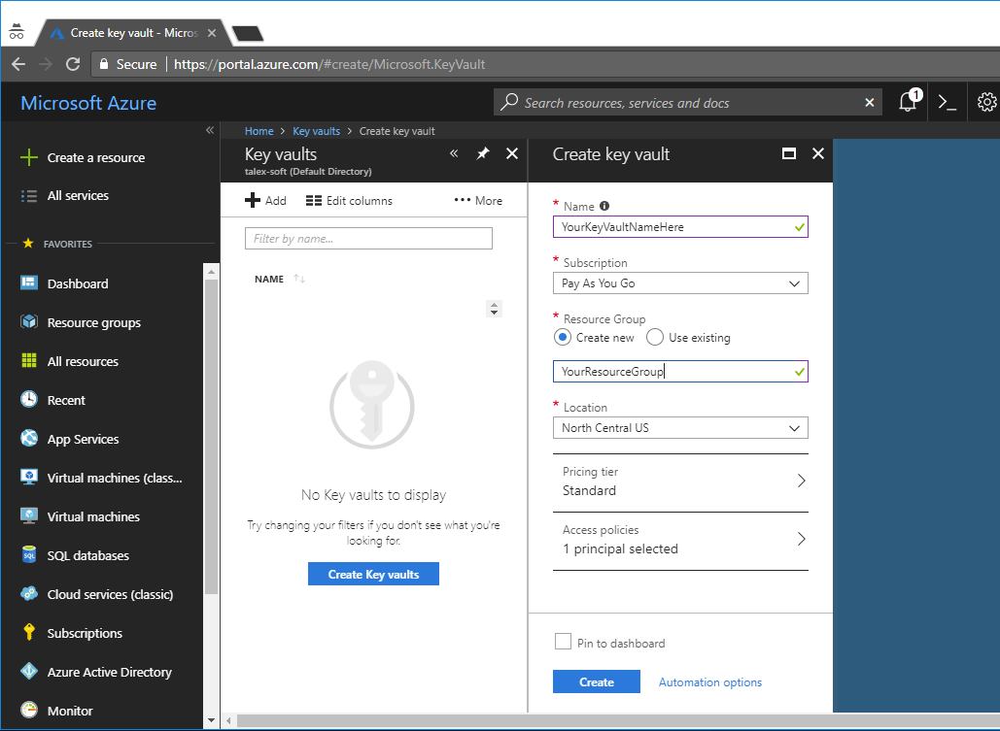
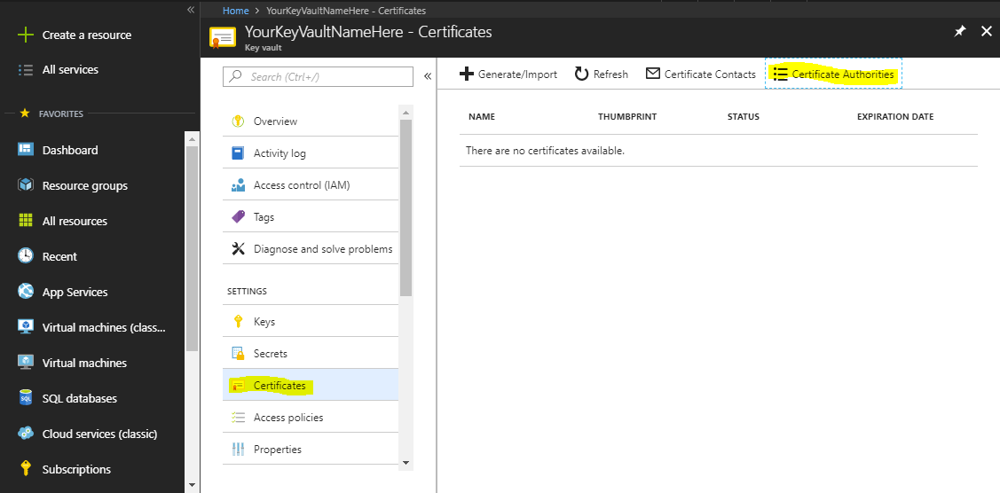
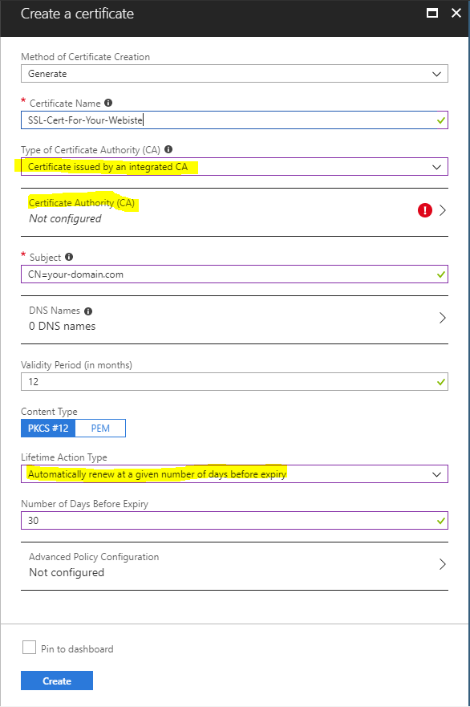
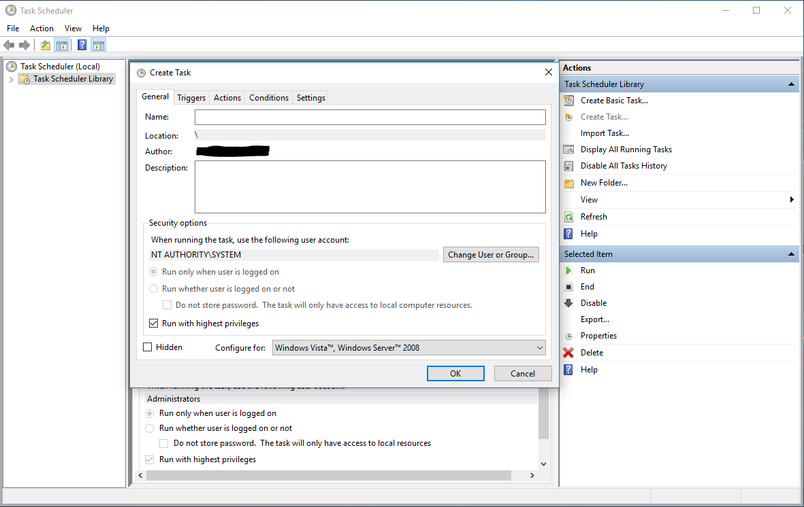

# Introduction

With the modern digital world, it's essential to be secure as possible to protect your business and your customers.

To accomplish this goal, you need to separate secrets for each purpose. If something is compromised, you will need to revoke/rotate only one of many.

Why do you need to rotate secrets? The answer is straightforward. Short living secrets have the advantage that in the event of a compromise they will work only for a short period until the next rotation.

From another hand, having short living secrets means that you need to rotate them more often which will cause pain from a secrets management point of view.
So you need to automate this process to make your life easier.

In these series of posts, I want to share some experience in this non-trivial journey!

<!--more-->

# Let's get started
The first post I would like to dedicate to **IIS (Internet Information Services)** and **SSL** certificates.
Why IIS? The typical scenario for legacy projects is a web application hosted directly on a VM and uses IIS as a web server. So SSL certificate rotation can be painful if done manually.

Any secret rotation can be divided into two parts. The first one is server side and the second one is the client.

# Server side
For this particular scenario, the server-side rotation is the easiest because automation is already done and managed by [Azure Key Vault](https://azure.microsoft.com/en-us/services/key-vault/). This Azure service offers a secure place to store all your secrets including: **certificates**, **passwords**, **storate keys**, **connection strings**, etc. If you don't have Key Vault yet, let's create it first.

### Creating Azure Key Vault

Navigate to all resources in Azure portal and search for Key Vault or click this [link](https://portal.azure.com/#create/Microsoft.KeyVault). Press **Create** button.


### Registering Certificate authorities
After this, you need to tie Azure and your **certificate authority**. As of today, Azure supports [DigiCert](https://www.digicert.com) and [GlobalSign](https://www.globalsign.com) certificate authorities.
So, create an account on one of them in advance and buy an SSL certificate. After this step, you can register authority in Azure.


### Creating Certificate
Finally, we have come to the last and most crucial step, automatically rotating certificate in Key Vault.
On **Certificates** tab click on **Generate/Import** button.


Don't forget to select your already created **Certificate Authority (CA)** and your website domain in **Subject name** field.

At this point, the first step is done. Your certificate will be auto-renewed 30 days before expiration.

# Client side
In this step, we will automate the process using **PowerShell**.
We will create one script to pull all certificates from KeyVault, the second one to assign SSL certificate to HTTPS binding for your application in IIS, and the last one is the startup script for **Task Scheduler**.

### Pulling all certificates from Key Vault
This step will require you to have an **AAD application** which will have access to your KeyVault. Then you should register certificate-based access to your application. Yes, one more certificate which needs to be auto-rotated, but this is out of the scope of this post.
AAD certificate is the only one certificate which should be pre-installed on your machine. The rest of them we will install with our automation.

The script will try to find all certificates with corresponding subject name and pick the longest valid by expiration date.
The selected certificate will be used to communicate with Key Vault to get all certificates, install them, add access to a private key for service account if needed and remove all already expired certificates.

**Pull-SecretsFromKV.ps1**
```powershell
param (
    [parameter(Mandatory = $True)]
    $KeyVaultName,

    [parameter(Mandatory = $True)]
    $AadApplicationId,

    [parameter(Mandatory = $True)]
    $TenantId,

    [parameter(Mandatory = $True)]
    $AadAuthCertSubjectName,

    [parameter(Mandatory = $False)]
    $Environment = "AzureCloud",

    [parameter(Mandatory = $False)]
    $ServiceAccount = ""
)

# Functions
function Write-Log($Message, $EntryType = "Information") {
    Write-Host $Message;

    $scriptName = [System.IO.Path]::GetFileNameWithoutExtension($MyInvocation.ScriptName);
    $sourceName = "PowerShellScript-$($scriptName)";
    
    if (![System.Diagnostics.EventLog]::SourceExists($sourceName)) {
        New-EventLog -LogName "Application" -Source $sourceName;
    }
    Write-EventLog -LogName "Application" -Source $sourceName -EventID 43636 -EntryType $EntryType -Message $Message;
}

$psVersion = $PSVersionTable.PSVersion;
Write-Log "PowerShell version: $psVersion";

if ($psVersion.Major -lt 5) {
    Write-Log "This script requires PowerShell version 5 or higher. Please update it." Error;
    return 1;
}

# Install Azure modules
Write-Log "Installing NuGet package provider...";
Install-PackageProvider -Name NuGet -Force;

Write-Log "Checking if AzureRM module is installed...";
if (-not (Get-Module -ListAvailable -Name AzureRM)) {
    Write-Log "AzureRM module is not installed. Installing...";
    Install-Module AzureRM -Force;
}

# Remove invalid certificates
Write-Log "Removing expired certificates.";
Get-ChildItem -Path "Cert:\LocalMachine\My" -ExpiringInDays 0 | Remove-Item;
Write-Log "Expired certificates have been successfully removed.";

# Get AAD cert
Write-Log "Getting all certificates with '$AadAuthCertSubjectName' subject name.";
$certs = Get-ChildItem -Path Cert:\LocalMachine\My\* -DnsName $AadAuthCertSubjectName | Where-Object { $_.HasPrivateKey -eq $True };

if ($certs.Count -eq 0) {
    Write-Log "There are no certificates with the '$AadAuthCertSubjectName' subject name or they don't have private keys, expired or does not have root certificate installed." "Error";
    return 1;
}

Write-Log "Found $($certs.Count) certificate(s).";

$aadAuthCert = $certs | Sort-Object -Property NotAfter -Descending | Select-Object -First 1;
Write-Log "The most recent certificate by expiration date is '$($aadAuthCert.NotAfter)' with thumbprint '$($aadAuthCert.Thumbprint)'.";

# Get all certificates from Key Vault
Write-Log "Login to Azure";
Login-AzureRmAccount `
    -Environment $Environment `
    -ServicePrincipal `
    -TenantId $TenantId `
    -ApplicationId $AadApplicationId `
    -CertificateThumbprint $aadAuthCert.Thumbprint;

$secrets = Get-AzureKeyVaultSecret -VaultName $KeyVaultName | Where-Object { $_.ContentType -eq "application/x-pkcs12" };

foreach ($secret in $secrets) {
    $certSecret = $secrets = Get-AzureKeyVaultSecret -VaultName $KeyVaultName -Name $secret.Name;
    $certObjectBytes = [System.Convert]::FromBase64String($certSecret.SecretValueText);
    $certificateChain = New-Object System.Security.Cryptography.X509Certificates.X509Certificate2Collection;
    $certificateChain.Import($certObjectBytes, $null, `
        [System.Security.Cryptography.X509Certificates.X509KeyStorageFlags]::Exportable -bor `
        [System.Security.Cryptography.X509Certificates.X509KeyStorageFlags]::MachineKeySet -bor `
        [System.Security.Cryptography.X509Certificates.X509KeyStorageFlags]::PersistKeySet);

    Write-Log "Found $($certificateChain.Count) certificates in the collection '$($secret.Name)'.";

    $certificates = @();

    if ($certificateChain.Count -eq 1) {
        $certificates += @{ StoreName = "My"; Body = $certificateChain[0] };
    } else {
        $certificates += $certificateChain | `
            Where-Object { $_.Subject -eq $_.Issuer } |`
            Select-Object @{ Name = "StoreName"; Expression = { "Root" } }, @{ Name = "Body"; Expression = { $_ } }

        $certificates += $certificateChain | `
            Where-Object { $subject = $_.Subject; ($subject -ne $_.Issuer) -and ($certificateChain | Where-Object { $subject -eq $_.Issuer }).Count -gt 0 } |`
            Select-Object @{ Name = "StoreName"; Expression = { "CertificateAuthority" } }, @{ Name = "Body"; Expression = { $_ } }

        $certificates += $certificateChain | `
            Where-Object { $subject = $_.Subject; ($subject -ne $_.Issuer) -and ($certificateChain | Where-Object { $subject -ne $_.Issuer }).Count -eq $certificateChain.Count } |`
            Select-Object @{ Name = "StoreName"; Expression = { "My" } }, @{ Name = "Body"; Expression = { $_ } }
    }

    foreach ($certificate in $certificates) {
        Write-Log "Installing '$($certificate.Body.SubjectName.Name)' [$($certificate.Body.Thumbprint)] certificate to '$($certificate.StoreName)' store.";

        try {
            $store = New-Object System.Security.Cryptography.X509certificates.X509Store $certificate.StoreName, 'LocalMachine';
            $store.Open("ReadWrite");
            $store.Add($certificate.Body);

            if (-not [string]::IsNullOrEmpty($ServiceAccount) -and $certificate.Body.HasPrivateKey) {
                Write-Log "Certificate has private key, adding account '$ServiceAccount' to access it.";

                # Create new CSP object based on existing certificate provider and key name
                $certContainerInfo = $certificate.Body.PrivateKey.CspKeyContainerInfo;
                $csp = New-Object System.Security.Cryptography.CspParameters( `
                    $certContainerInfo.ProviderType, `
                    $certContainerInfo.ProviderName, `
                    $certContainerInfo.KeyContainerName);

                $csp.Flags = "UseExistingKey","UseMachineKeyStore";
                $csp.CryptoKeySecurity = $certContainerInfo.CryptoKeySecurity;

                $access = New-Object System.Security.AccessControl.CryptoKeyAccessRule($ServiceAccount, "FullControl", "Allow");
                $csp.CryptoKeySecurity.AddAccessRule($access);

                # Create new CryptoServiceProvider object which updates Key with CSP information created/modified above
                $rsa2 = New-Object System.Security.Cryptography.RSACryptoServiceProvider($csp);
                $rsa2.Dispose();
            }

            $store.Close();
        } catch {
            Write-Log "The following error occur: '$_' durring installation of certificate." "Error";
        }
    }

    Write-Log "-----------------";
}
```

### Updating HTTPS binding in IIS
In the script below we will find all certificates with corresponding DNS names, sort by expiration date and pick the longest one. Finally, we will update the IIS binding.

**Set-SslCertForIIS.ps1**
```powershell
param
(
    [parameter(Mandatory = $True)]
    $SiteName,

    [parameter(Mandatory = $True)]
    $SslCertDnsNames
)

# Functions
function Write-Log($Message, $EntryType = "Information") {
    Write-Host $Message;

    $scriptName = [System.IO.Path]::GetFileNameWithoutExtension($MyInvocation.ScriptName);
    $sourceName = "PowerShellScript-$($scriptName)";
    
    if (![System.Diagnostics.EventLog]::SourceExists($sourceName)) {
        New-EventLog -LogName "Application" -Source $sourceName;
    }
    Write-EventLog -LogName "Application" -Source $sourceName -EventID 43636 -EntryType $EntryType -Message $Message;
}

Write-Log "Getting all certificates with '$SslCertDnsNames' dns name(s).";
$dnsNames = $SslCertDnsNames.Split(';');
$certs = Get-ChildItem -Path Cert:\LocalMachine\My\* | Where-Object { $_.HasPrivateKey -eq $True -and $_.Verify() -and ($_.DnsNameList | Where-Object { $_ -In $dnsNames }).Length -eq $dnsNames.Length };

if ($certs.Count -eq 0) {
    Write-Log "There are no certificates with the '$SslCertDnsNames' DNS name(s) or they don't have private keys, expired or does not have the root certificate installed." "Error";
    return;
}

Write-Log "Found $($certs.Count) certificate(s).";

$lastCertificate = $certs | Sort-Object -Property NotAfter -Descending | Select-Object -First 1;
Write-Log "The most recent certificate by expiration date is '$($lastCertificate.NotAfter)' with thumbprint '$($lastCertificate.Thumbprint)'.";

# Validation
Write-Log "Validating certificate.";
$lastCertificate | Test-Certificate -Policy SSL -ErrorAction Stop | Out-Null;

# Assigning
Write-Log "Updating SSL certificate for IIS binding.";
$binding = Get-WebBinding -Name $SiteName -Protocol "https";
if ($binding -eq $null) {
    Write-Log "Website with name '$SiteName' or HTTPS binding does not exists." "Error";
    return;
}

$binding.AddSslCertificate($lastCertificate.Thumbprint, "My");

Write-Log "Certificate with thumprint '$($lastCertificate.Thumbprint)' has been assigned to website '$SiteName'.";
```

### Startup Script
This script will trigger two scripts above and will pass all necessary parameters to make our automation possible.

**Startup.ps1**
```powershell
$keyVaultName = "<Your-Key-Vault-Name-HERE>";
$aadApplicationId = "<Your-AAD-Application-Id-HERE>";
$tenantId = "<Your-AAD-Tenant-Id-HERE>";
$environment = "AzureCloud"; # AzureCloud, AzureChinaCloud, AzureUSGovernment, AzureGermanCloud
$aadAuthCertSubjectName = "<AAD-Application-Certificate-Subject-Name-HERE>";
$serviceAccount = "<Domain>\<Service-Account-Name-HERE>";
$siteName = "<IIS-Application-Name-HERE>";
$sslCertDnsNames = "<Semicolon-List-Of-Dns-Names-For-Your-SSL-Certificate-HERE>";

$status = & "$PSScriptRoot\Pull-SecretsFromKV.ps1" -KeyVaultName $keyVaultName -AadApplicationId $aadApplicationId -TenantId $tenantId -Environment $environment -AadAuthCertSubjectName $aadAuthCertSubjectName -ServiceAccount $serviceAccount;
if ($status -eq 1) { return 1; }
& "$PSScriptRoot\Set-SslCertForIIS.ps1" -SiteName $siteName -SslCertDnsNames $sslCertDnsNames;
```

### Creating Scheduler Task
The very last step. Create scheduled task:

* Give it a descriptive name (SecretsAutoRotation etc.)
* Click **Change User or Groups...** button and change value to **SYSTEM** account to have access to the certificate store.
* Add a trigger to run task periodically (daily, etc.).
* Add an action to run ```Startup.ps1``` script.
   *  Program/script: **powershell**
   * Add arguments: ```-command "& <Your-Path-To-Startup-Script>\Startup.ps1"```.



# Home assignment
There is no limit to perfection. You can try to improve this process in the following ways:
* Upload your scripts, except Startup script, to Azure Storage to eliminate manually updating them all the time.
* Or even better, you can leverage [Azure Automation](https://azure.microsoft.com/en-us/services/automation/)  and [DSG (Desired State Configuration)](https://docs.microsoft.com/en-us/azure/automation/automation-dsc-overview).
